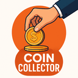

# 🛒 AliExpress Coins Collector – Chrome Extension (Private Project)

  
  
  
  
  

## 🔒 Important Notice

**This is a private project** by Mordechai Naaman. The code is available for viewing and learning purposes only.

### Usage Rights
- ✅ **Viewing and Research** – You may view and study the code
- ✅ **Personal Use** – You may install and use the extension for personal purposes
- ✅ **Learning** – You may learn from the code and use it as inspiration
- ❌ **Commercial Use** – Not allowed without explicit written permission
- ❌ **Distribution** – Not allowed to distribute or sell
- 🔒 **Attribution Required** – Credit is mandatory for any use or derivative work

## 📖 Description

Private and advanced Chrome extension for automated AliExpress coins collection, featuring a modern UI, dark mode, analytics dashboard, and advanced functionality.

## ✨ Key Features

- 🕙 **Automated Scheduling** – Daily collection at 10:30
- 🔗 **Dynamic Link Management** – Add, delete, export/import links
- 🌙 **Dark Mode** – Modern design for all hours
- 📊 **Advanced Analytics** – Track success rates and statistics
- 🔔 **Smart Notifications** – Real-time updates
- 💾 **Cloud Sync** – Data storage across devices
- 📈 **Interactive Charts** – Visualize progress

## 🚀 Installation (Personal Use Only)

⚠️ **Note:** Installation is intended for personal and educational use only

1. Download the code:
git clone https://github.com/MordechaiN/aliexpress-coins-collector-chrome.git
cd aliexpress-coins-collector-chrome

2. Open Chrome and go to: `chrome://extensions/`

3. Enable "Developer mode" in the top right corner

4. Click "Load unpacked" and select the project folder

## 📱 Usage

1. **Initial Setup:** The extension will start automatically tomorrow at 10:30
2. **Manage Links:** Click the extension icon → "Manage Links"
3. **View Analytics:** Click "📊 Advanced Analytics"
4. **Dark Mode:** Click 🌙 in the top left corner

## 🛠️ Technologies

- **Manifest V3** – Latest Chrome Extensions API
- **JavaScript ES6+** – With Async/Await
- **Chrome Storage Sync** – Data sync across devices
- **Chrome Notifications API** – Advanced notifications
- **HTML5 & CSS3** – Modern, responsive design

## 🔒 Copyright and License

© 2025 Mordechai Naaman. All rights reserved.

**Attribution Required:** Any use, modification, or derivative work must include full credit to the original developer:

Based on AliExpress Coins Collector by Mordechai Naaman
GitHub: https://github.com/MordechaiN/aliexpress-coins-collector-chrome

## 📞 Contact

**Mordechai Naaman**
- GitHub: [@MordechaiN](https://github.com/MordechaiN)
- Email: mordechaineeman@outlook.com

📧 **For commercial use or special permissions** – Contact directly

## ⚖️ Disclaimer

The extension is provided "as is" without any warranty. Use at your own risk.

---

  <strong>🔒 Private Project – Personal Use Only</strong> 
  <em>Commercial use or distribution requires prior authorization</em>

